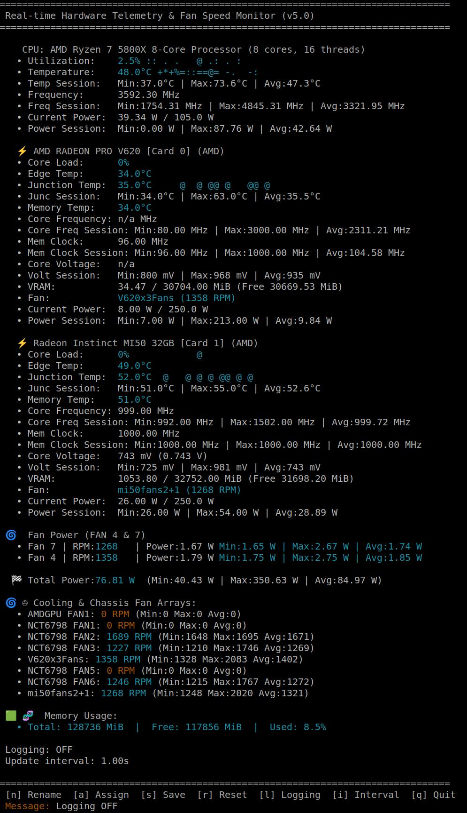

<h1>Linux HW GPU Monitor</h1>

A real-time, terminal-based hardware monitor for Linux. Features deep AMD Radeon instinct Mi50, Radeon Pro v620 and many more GPU's telemetry (Junction/Hotspot temps), NVIDIA/Intel support, and custom sensor mapping.

<h2>✨ Features</h2>
<ul>
  <li><b>Multi-Vendor Support:</b> Automatically detects and monitors AMD, NVIDIA (via <code>nvidia-smi</code>), and Intel GPUs.</li>
  <li><b>Deep AMD Telemetry:</b> Dynamically reads and displays Edge, Junction (Hotspot), and Memory (VRAM) temperatures.</li>
  <li><b>Visual Analytics:</b> ASCII sparklines show real-time trends for CPU/GPU utilization and Junction temperatures.</li>
  <li><b>Smart Alerting:</b> Color-coded text (Cyan/Yellow/Red) warns you when Junction temperatures approach thermal throttling limits (90°C+).</li>
  <li><b>Total Power Budget:</b> Calculates total system power draw by combining CPU RAPL, GPU power, and estimated fan power.</li>
  <li><b>Custom Sensors:</b> Map any custom file path (like NVMe drives or water cooling pumps) via a simple JSON configuration.</li>
  <li><b>Session Statistics:</b> Tracks Min, Max, and Average values for all metrics during your session.</li>
  <li><b>CSV Logging:</b> Optional background logging to <code>hardware_log.csv</code> for historical analysis.</li>
</ul>

<h2>🚀 Installation</h2>
<ol>
  <li>Clone this repository:
    <pre><code>git clone https://github.com/catx123/linux-hw-GPUmonitor.git
cd linux-hw-GPUmonitor</code></pre>
  </li>
  <li>Install the required Python dependencies:
    <pre><code>pip install -r requirements.txt</code></pre>
  </li>
</ol>

<h2>⚡ Usage</h2>

Run the monitor using Python 3:

<pre><code>sudo python3 monitor.py</code></pre>

<b>Note on <code>sudo</code>:</b> Running with <code>sudo</code> is recommended to read CPU power consumption via the RAPL interface (<code>/sys/class/powercap/</code>). If run as a standard user, the CPU power will display as <code>0.00 W</code>, but all other metrics (temperatures, fans, GPUs) will work perfectly.

<h2>️ Controls</h2>
<ul>
  <li><code>[n]</code> Rename a system fan.</li>
  <li><code>[a]</code> Assign a chassis fan to a specific GPU.</li>
  <li><code>[s]</code> Save current fan names, assignments, and settings.</li>
  <li><code>[r]</code> Reset all session statistics (Min/Max/Avg) and sparklines.</li>
  <li><code>[l]</code> Toggle CSV logging ON/OFF.</li>
  <li><code>[i]</code> Change the screen update interval (default 1.00s).</li>
  <li><code>[q]</code> Quit the application.</li>
</ul>

<h2>🛠️ Custom Manual Sensors</h2>

If you have a sensor that isn't automatically detected (like a specific NVMe drive or liquid cooling pump), you can manually map it.

<ol>
  <li>Create a file named <code>custom_sensors.json</code> in the same directory.</li>
  <li>Add your sensors in the following format:
    <pre><code>[
  {
    "name": "NVMe Drive Temp",
    "path": "/sys/class/hwmon/hwmon4/temp1_input",
    "scale": 1000,
    "unit": "°C"
  }
]</code></pre>
  </li>
  <li>Restart the script. The sensors will appear in the "Custom Manual Sensors" section.</li>
</ol>

<h2>📄 License</h2>

This project is licensed under the Apache License 2.0 - see the LICENSE file for details.

